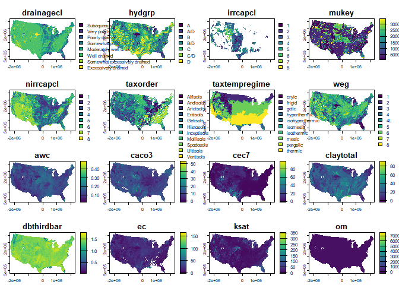

<!-- README.md is generated from README.Rmd. Please edit that file -->

# rdshub

<!-- badges: start -->

[](https://github.com/brownag/rdshub/actions/workflows/R-CMD-check.yaml)
[](https://lifecycle.r-lib.org/articles/stages.html#experimental)
<!-- badges: end -->

The goal of {rdshub} is to provide experimental functions for
interacting with public-facing ‘Dynamic Soils Hub’ tools and APIs.

Currently the following functions are available:

- `dsh_soil_properties()`

> \[!NOTE\]
>
> Contents of this package may change at any time based on server-side
> changes and new approaches. Well-polished functions may be moved to
> other packages eventually.

## Installation

You can install the development version of rdshub from
[GitHub](https://github.com/brownag/rdshub) with:

``` r
# install.packages("remotes")
remotes::install_github("brownag/rdshub")
```

## Example

This is a basic example demonstrating how to obtain variables with top
depth `0` cm, and bottom depth `0` cm and `200` cm.

The result includes all “site” level variables that have a `"domcond"`
(dominant condition) aggregation, as well as all `"wtdavg"` (depth
weighted average) variables for interval `[0,200]`

``` r
library(rdshub)
library(terra)
#> Warning: package 'terra' was built under R version 4.5.1
#> terra 1.8.56

x <- dsh_soil_properties(
  # variables = c("claytotal", "sandtotal", "silttotal", "drainagecl"),
  top_depth = 0,
  bottom_depth = c(0, 200),
  aggregations = c("wtdavg", "domcond"),
  resolutions = 900
)

terra::sources(x)
#>  [1] "/vsicurl/https://s3-fpac-nrcs-dshub-public.s3.us-east-1.amazonaws.com/SoilProperties/conus_5070_conus_900_1_000_000_drainagecl_domcond.tif"   
#>  [2] "/vsicurl/https://s3-fpac-nrcs-dshub-public.s3.us-east-1.amazonaws.com/SoilProperties/conus_5070_conus_900_1_000_000_hydgrp_domcond.tif"       
#>  [3] "/vsicurl/https://s3-fpac-nrcs-dshub-public.s3.us-east-1.amazonaws.com/SoilProperties/conus_5070_conus_900_1_000_000_irrcapcl_domcond.tif"     
#>  [4] "/vsicurl/https://s3-fpac-nrcs-dshub-public.s3.us-east-1.amazonaws.com/SoilProperties/conus_5070_conus_900_1_000_000_mukey_domcond.tif"        
#>  [5] "/vsicurl/https://s3-fpac-nrcs-dshub-public.s3.us-east-1.amazonaws.com/SoilProperties/conus_5070_conus_900_1_000_000_nirrcapcl_domcond.tif"    
#>  [6] "/vsicurl/https://s3-fpac-nrcs-dshub-public.s3.us-east-1.amazonaws.com/SoilProperties/conus_5070_conus_900_1_000_000_taxorder_domcond.tif"     
#>  [7] "/vsicurl/https://s3-fpac-nrcs-dshub-public.s3.us-east-1.amazonaws.com/SoilProperties/conus_5070_conus_900_1_000_000_taxtempregime_domcond.tif"
#>  [8] "/vsicurl/https://s3-fpac-nrcs-dshub-public.s3.us-east-1.amazonaws.com/SoilProperties/conus_5070_conus_900_1_000_000_weg_domcond.tif"          
#>  [9] "/vsicurl/https://s3-fpac-nrcs-dshub-public.s3.us-east-1.amazonaws.com/SoilProperties/conus_5070_conus_900_1_000_200_awc_wtdavg.tif"           
#> [10] "/vsicurl/https://s3-fpac-nrcs-dshub-public.s3.us-east-1.amazonaws.com/SoilProperties/conus_5070_conus_900_1_000_200_caco3_wtdavg.tif"         
#> [11] "/vsicurl/https://s3-fpac-nrcs-dshub-public.s3.us-east-1.amazonaws.com/SoilProperties/conus_5070_conus_900_1_000_200_cec7_wtdavg.tif"          
#> [12] "/vsicurl/https://s3-fpac-nrcs-dshub-public.s3.us-east-1.amazonaws.com/SoilProperties/conus_5070_conus_900_1_000_200_claytotal_wtdavg.tif"     
#> [13] "/vsicurl/https://s3-fpac-nrcs-dshub-public.s3.us-east-1.amazonaws.com/SoilProperties/conus_5070_conus_900_1_000_200_dbthirdbar_wtdavg.tif"    
#> [14] "/vsicurl/https://s3-fpac-nrcs-dshub-public.s3.us-east-1.amazonaws.com/SoilProperties/conus_5070_conus_900_1_000_200_ec_wtdavg.tif"            
#> [15] "/vsicurl/https://s3-fpac-nrcs-dshub-public.s3.us-east-1.amazonaws.com/SoilProperties/conus_5070_conus_900_1_000_200_ksat_wtdavg.tif"          
#> [16] "/vsicurl/https://s3-fpac-nrcs-dshub-public.s3.us-east-1.amazonaws.com/SoilProperties/conus_5070_conus_900_1_000_200_om_wtdavg.tif"            
#> [17] "/vsicurl/https://s3-fpac-nrcs-dshub-public.s3.us-east-1.amazonaws.com/SoilProperties/conus_5070_conus_900_1_000_200_sandtotal_wtdavg.tif"     
#> [18] "/vsicurl/https://s3-fpac-nrcs-dshub-public.s3.us-east-1.amazonaws.com/SoilProperties/conus_5070_conus_900_1_000_200_sar_wtdavg.tif"           
#> [19] "/vsicurl/https://s3-fpac-nrcs-dshub-public.s3.us-east-1.amazonaws.com/SoilProperties/conus_5070_conus_900_1_000_200_silttotal_wtdavg.tif"

terra::metags(x, layer = 1)
#>   layer        name          value
#> 1     1 aggregation        domcond
#> 2     1      bottom              0
#> 3     1    endpoint SoilProperties
#> 4     1    location          conus
#> 5     1   territory          conus
#> 6     1         top              0
#> 7     1    variable     drainagecl
#> 8     1     version              1

vars <- x |>
  terra::metags(seq_len(terra::nlyr(x))) |>
  subset(name == "variable")
names(x) <- vars$value

terra::plot(x)
#> Warning: [plot] unknown categories in raster values
#> Warning: [plot] unknown categories in raster values
#> Warning: [plot] unknown categories in raster values
#> Warning: [plot] unknown categories in raster values
#> Warning: [plot] unknown categories in raster values
```



``` r

x$sandtotal + x$claytotal + x$silttotal
#> class       : SpatRaster 
#> size        : 3250, 5150, 1  (nrow, ncol, nlyr)
#> resolution  : 900, 900  (x, y)
#> extent      : -2356125, 2278875, 270045, 3195045  (xmin, xmax, ymin, ymax)
#> coord. ref. : NAD83 / Conus Albers (EPSG:5070) 
#> source(s)   : memory
#> varname     : conus_5070_conus_900_1_000_200_sandtotal_wtdavg 
#> name        : sandtotal 
#> min value   :    0.0000 
#> max value   :  161.5763 
#> depth       : 100
```
